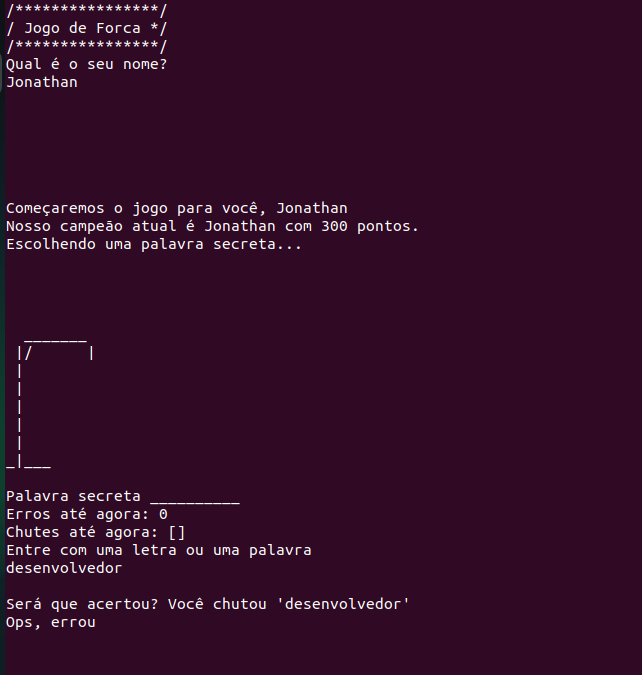
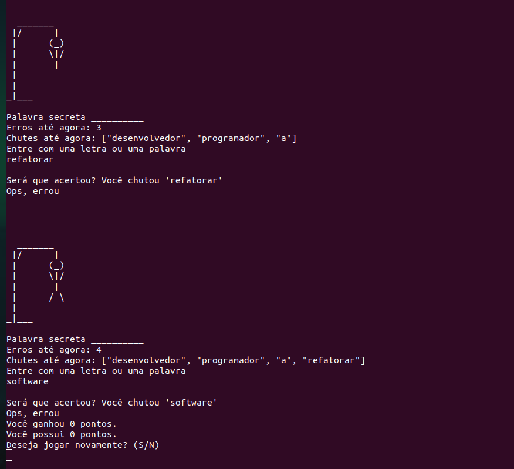
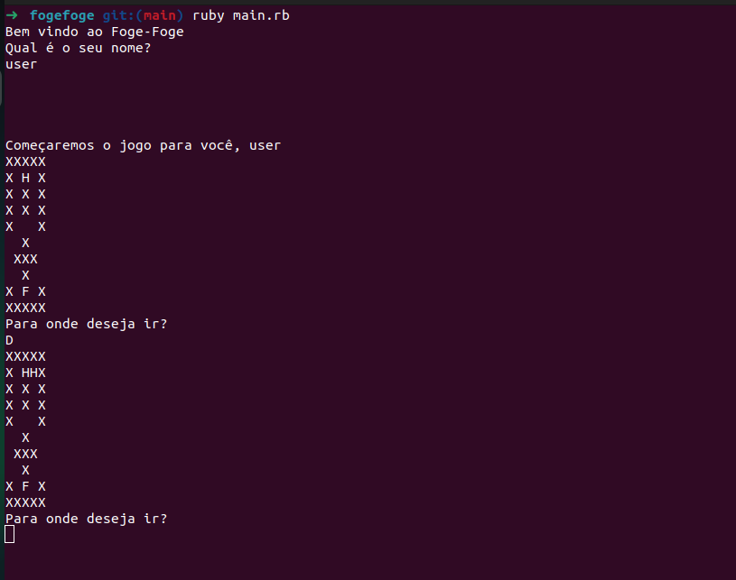
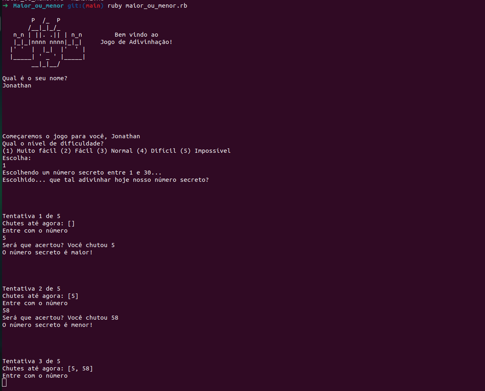
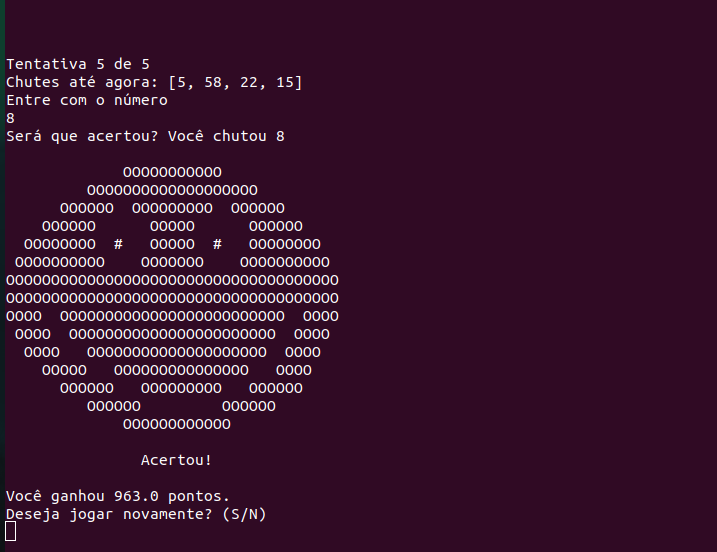

 

  

<h1 align="center" style="text-align: center;">Little silly games</h1>

	<b></b> 
	Created with Ruby only, using by terminal. 

 

<h2>Hangman (Forca)</h2>

<h2>Run run (Foge foge)</h2>

<h2>More or less (Maior ou menor)</h2>

